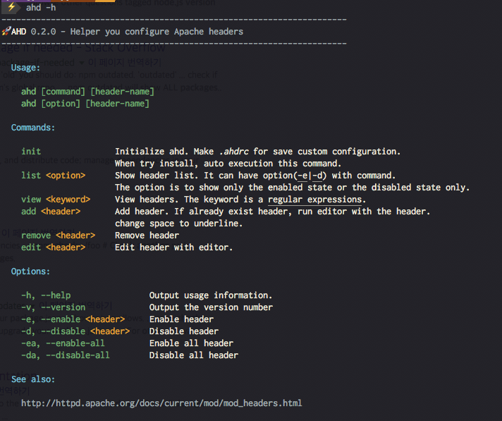

# Apache Header Helper

[](https://travis-ci.org/wicksome/ahd)
[](https://badge.fury.io/js/ahd)

> Helper you configure Apache headers



## Installation

**Requirements**

- node, npm

**Install**

```bash
$ sudo npm install -g ahd
$ sudo ahd init
```

**Recommand**

아파치를 재시작해야 하기 때문에 sudo로 실행해야 한다. 매번 sudo를 치지 않기 위해서 `.bachrc`나 `.bash_profile`에 alias를 추가하는 것을 추천한다.

```sh
alias ahd="sudo ahd"
```

## Update

```bash
$ sudo npm outdated -g ahd # check version
$ sudo npm install -g ahd
```

## Usage

```sh
$ ahd -h # help
$ ahd -v # version

# Show List
$ ahd list # shortcut 'l'
$ ahd l -e # Show enable header
$ ahd l -d # Show disable header

# Set header
$ ahd -eo wicksome # enable only
$ ahd -e wicksome # enable
$ ahd -d wicksome # disable
$ ahd -d .+@.+ # Interpret pattern as an extended regular expression
$ ahd -ea # enable all
$ ahd -da $ disable all

# Manege header
$ ahd view wicksome # shortcut 'v'
$ ahd add wicksome-test # shortcut 'a'
$ ahd remove wicksome-test # shortcut 'r'
$ ahd edit wicksome # shortcut 'e'
```


### Autocomplete headers using [fzf](https://github.com/junegunn/fzf)

- install

    ```sh
    $ brew install fzf
    $ /usr/local/opt/fzf/install
    ```

- set config `.bash_profile`

    ```sh
    _fzf_complete_ahd() {
      _fzf_complete "--reverse" "$@" < <(
        ls ~/.ahd
      )
    }
    ```
    
    zsh will automatically pick up the command using the naming convention but in bash you have to connect the function to the command using `complete` command.
    
    ```sh
    [ -n "$BASH" ] && complete -F _fzf_complete_ahd -o default -o bashdefault ahd
    ```

- usage

    ```sh
    $ ahd -eo **<TAB>
    ```
